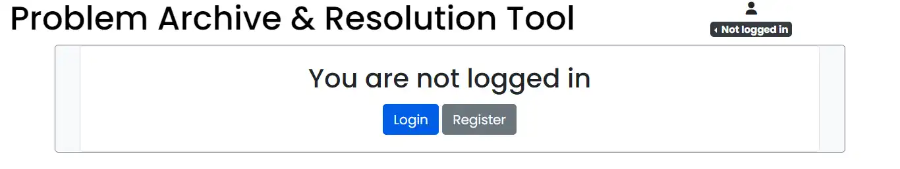

# Problem Archive & Resolution Tool

Problem Archive & Resolution Tool (PART) is a website designed to make keeping track of maintenence tasks in a hospitality setting. Users can log defects, sort them into categories of their own choosing, provide new information (updates) when there are developements, and once the problem is resolved it is archived.

The website can be accessed [here](https://bb-gp-pp4-part-07cc42d9a56e.herokuapp.com/)

It has been designed specifically with old buildings or facilities in mind, or where there may be a high turnover of staff, or where different shifts or roles within the business may not have existing ways of communicating the necesary easy fixes or workarounds that could save time and money. I have experienced all of these problems at the cinema where I work.

The design is minimalist, emphasizing presentation and readability of information. Colour is used to convey information. The images are uploaded by the users. Links to defects and updates are black by default, while pagination navigation links are blue. Button links are coloured so that the main action will be coloured blue, while other options will be coloured grey, or red in the case of the delete button.

## Readme Contents

- [Features](#features)
  - [Existing Features](#existing-features)
  - [Features to implement](#features-to-implement)
- [User Experience Design](#user-experience-design)
  - [User Journey](#user-journey)
  - [User Stories](#user-stories)
- [Technologies](#technologies)
- [Testing](#testing)
  - [Manual Testing](#manual-testing)
  - [Automated Testing](#automated-testing)
  - [Validator Testing](#validator-testing)
  - [Unfixed Bugs](#unfixed-bugs)
- [Deployment](#deployment)
- [Credits](#credits)
  - [Content](#content)
  - [Media](#media)
  - [Code](#code)
  - [Acknowledgements](#acknowledgements)

## Features

### Existing Features

- Defect database

  - There are three models in the defect database, two of wich relate to the auth.User model

  

- Account authorisation

  - To use any of the site's functionality, a user must sign up for an account. Attempting to navigate to any pages with defect data will result in a mostly empty page prompting the user to log in.

  

  - Once the user signs up for an account, they must still be approved. Once approved by an admin, the user will have some permissions, depending on their group. The groups and permissions are:
    - Level 1 - the user can view categories, defects and updates, and can log new defects, but cannot add updates or categories. This level is intended for low level employees who may be more likely to find something that needs reporting, but do not have the training or authorisation to fix them. The navigation bar is visible for level 1 and up.
    - Level 2 - the user can do everything a level 1 user can, but they can also add updates. This level is intended for supervisors/management, who would need to communicate the progress made resolving any defects.
    - Level 3 - the user can do everything level 1 & 2 users can, but they can also add categories, assign users to groups and edit defects, updates and categories. The users link is active in the navigation bar. This level is intended for the general manager or member of the management team responsible for maintenence.
    - Superusers have all permissions.

- Account indicator

  - Situated at the top right corner of every page, the account indicator shows the username and access level, as well as options to sign in or out.

  - When logged out, the account indicator appears dark grey with the text 'not logged in'. Clicking on the text opens a menu with links to sign in and sign up pages.

  

  - When logged in, the account indicator shows the user's username. Clicking on the text opens a menu showing the user's access level and a link to the sign out page. Access levels are colour coded:

      - If a user has not been approved to use any of the site's functions, it appears red and shows 'no access'.

      

      - If a user has level 1 access, the indicator appears green and shows 'Level 1 access'.

      

      - If a user has level 2 access, the indicator appears pale blue and shows 'Level 2 access'.

      

      - If a user has level 3 access or is a superuser, the indicator appears gold and shows 'Level 3 access'.

      

- Navigation Bar

  - Includes links to all parts of the website, allowing users to easily navigate between them. It is only visible if a user is logged in and the users link is greyed out and not functional for all users apart from level 3 and superusers.
  - On smaller devices the menu links are condensed into a dropdown menu, saving valuable screen space.

  

- Dashboard

  - After logging in, or when returning to the website when already logged in, the dashboard shows the 5 most recent defects and updates, with links. Vital information like category, number of updates, title, date reported, update body, author and if the update contains an image are shown. The title and body sections are links to the relevant detail page, with the update link going directly to that update on the defect detail page. If there is an image contained in the update, the link opens this image directly in a new tab. This enables the user to go straight to the most recent content without having to go through menus or search filters. There is also a link to the log defect page at the bottom.

  

- Log defect page

  - The Log defect page enables the user to add instances of the defect model. The form is kept brief to minimise the time spent filling in the form, as the user will likely be doing so from a smart phone, in or near unpleasant conditions (in the dark, in a flood, etc)

  

- Defects List

  - The defects section includes a paginated list of all defects in the database. Similar to the dashboard, vital information like category, number of updates, title, date reported and author are shown.

  - Search functionality wich is hidden by default can be revealed by clicking on "Toggle search options". This opens a list of filters the user can apply to the data shown on the page, as well as an option to sort by date reported. This is styled to appear differently on smaller screens, maintaining large enough buttons to reduce the risk of touching the incorrect one on a touchscreen.
  - The search filters will stay applied until the page is navigated to again or until the reset button is clicked.

  

- Defect detail section

  - The Defect detail section displays the data for that particular entry, including any images.

  

- update form

  

- delete modal

  

- Categories section

  - category list

  

- Sign in page

  

- Sign out page

  

- Sign up page

  

- custom 404 and 500 pages

  

- Favicon

  

### Features to implement

- Light/dark mode

- non admin user CRUD

- keywords/tags

- More extensive filtering & sorting

- different cascade

## User Experience Design

### User Journey

- User Journey

  - A user first notices a problem and logs it as a defect, optionally adding an image to better illustrate location or severity.

  - If a manager was not the reporter, they can begin taking steps to resolve the issue, calling the relevant contractor and taking steps to mitigate in the meantime. This can all be communicated in updates.

  - A contractor arrives and fixes the problem, explaining to the manager what went wrong and what they did to fix it (and how much it cost.) The manager adds all of this information in an update, marking the defect as resolved.

  - The entry stays in the database so that if the same problem, or similar, arises the management can see everything that was tried last time including how long it took to fix and how much it cost, and can plan accordingly.

  

### User Stories

The [Github Projects Kanban board](https://github.com/users/bezabu/projects/5/views/1) was used to organise user stories.

The user stories are as follows:

- As a Site User I can register an account so that I can log in and use the site functionality
  - Acceptance Criteria
    - AC1 Given an email a user can register an account.
    - AC2 Then the user can log in.
    - AC3 The site content is hidden unless logged in

- As a Site User I can log defects so that problems with building facilities and structure can be tracked and mitigated/repaired easier
  - Acceptance Criteria:
    - AC1 A defect can be logged as a specific entry in a database
    - AC2 The entry contains relevant information such as location, category(plumbing/electrical etc), date reported
    - AC3 The defect can be viewed by other site users

- As a Site User I can fill out a form so that I can add new defect information to the database
  - Acceptance Criteria
    - AC1 If the user is logged in they can access the log defect form
    - AC2 The completed form adds data to the defect model
    - AC3 Successful form entries are confirmed

## Technologies

- HTML has been used to structure the website.
- CSS has been used to style the website.
- JavaScript was used for the edit and delete buttons.
- Python was used as the main language in which this project was coded.
- [Django](https://www.djangoproject.com/) was the framework used to build this website.
- [Bootstrap 4.6](https://getbootstrap.com/docs/4.6/) was used to create and style the front end of the website.
- [Font Awesome](https://fontawesome.com/) icons have been used for category icons, column headers and user icons.
- [Google Fonts](https://fonts.google.com/) has been used to import the Poppins font.
- [Paint.NET](https://www.getpaint.net/) was used to edit the hammer image before using it with Favicon.
- [Real Favicon Generator](https://realfavicongenerator.net/) was used to create the favicon for the website.
- [GitPod](https://gitpod.io/) was used as IDE
- [Google Chrome Developer Tools](https://developer.chrome.com/docs/devtools/) were used to inspect elements of the website and test different styles.
- [GitHub](https://github.com/) has been used to store the code, images, and other contents of the website.
- [Heroku](https://dashboard.heroku.com/) was used to deploy the website to the web.
- Git was used for version control, pushing contents to GitHub.
- [W3C Markup Validation Service](https://validator.w3.org/) was used to check HTML.
- [W3C CSS Validation Service](https://jigsaw.w3.org/css-validator/) was used to check CSS.
- [JSHint](https://jshint.com/) was used to test the javascript code.
- [CI Python Linter](https://pep8ci.herokuapp.com/) was used to test Python code.
- [Wave Web Accessibility Evaluation Tool](https://wave.webaim.org/) was used to test the website's accessibility.
- Lighthouse was used to run an audit of the website.
- [Am I Responsive](https://ui.dev/amiresponsive) was used to create the mockup.
- [Grammar Check](https://www.grammarcheck.net/) was used to check for typos in Readme.md.

## Testing

### Manual Testing

- Check responsiveness in different browsers (Chrome, Firefox, Edge, Opera)
  - Test:
    - Open the website in a browser
    - Log in as a level 1 or higher user
    - Right click on the page and select 'Inspect' or 'Inspect element'
    - Slowly resize the responsive window down to 300px and back again, observing changes at each breakpoint
  - Result:
    - All media queries work correctly

- Check that content is not visible if not logged in
  - Test
    - Open the website in a browser
    - Navigate to dashboard, defect list, category list and add new defect pages by typing in the URL
  - Result
    - No defect data is displayed to the user

- Check that content is only visible if logged in as a level 1 or higher user
  - Test
    - Open the website in a browser
    - sign up for a new account
    - Navigate to dashboard, defect list, category list and add new defect pages by typing in the URL
  - Result
    - No defect data is displayed to the user. A message is shown on the dashboard informing the user that they must be approved

- Check that the appropriate information and permissions are available to each level (group)
  - Test
    - Open the website in a browser
    - Log in as a level 1 or higher user
    - Observe the users link in the navigation bar
    - Observe the defect detail page
    - Observe the category list page
  - Result
    - The users link is deactivated and the update and add category forms do not appear

  - Test
    - Open the website in a browser
    - Log in as a level 2 or higher user
    - Observe the users link in the navigation bar
    - Observe the defect detail page
    - Observe the category list page
  - Result
    - The users link is deactivated and the add category form does not appear.
    - The update form appears at the end of the defect detail page

  - Test
    - Open the website in a browser
    - Log in as a level 3 or higher user
    - Observe the users link in the navigation bar
    - Observe the defect detail page
    - Observe the category list page
  - Result
    - The users link points to admin/ and the update and category forms are both present

- Check that the account indicator is showing the correct information and options
  - Test
    - Open the website in a browser
    - Log in as each level of user
    - Observe the colour of the account indicator and the options displayed in the dropdown menu when clicking on the username
  - Result
    - The correct colour is shown for each level of user (dark grey for not logged in, red for unapproved, green for level 1, blue for level 2, yellow for level 3)
    - The text displayed is the correct user name if logged in, the text "Not logged in" if not logged in
    - The drop down menu options are sign in, sign up if not logged in
    - The drop down menu options are access level, sign out if logged in
 
- Check all navigation links point to correct pages
  - Test:
    - Open the website in a browser
    - Log in as a level 3 user
    - Click on all links in the navigation bar (Log New Defect, Home, Defects, Categories, Users, Log out) from each page to ensure they lead to the correct pages.
  - Result:
    - All links work correctly

- Check Defect form validation works correctly
  - Test:
    - Open the website in a browser
    - Log in as a level 1 or higher user
    - Navigate to the Log New Defect page
    - Click on the Submit button without entering any information. Observe the prompt for each part of the form where input is required.
  - Result:
    - All form inputs that require input (Category, Title, Body) prompt the user for input if not filled in properly

- Check Update form validation works correctly
  - Test:
    - Open the website in a browser
    - Log in as a level 2 or higher user
    - Navigate to the Log New Defect page
    - Click on the Submit button without entering any information. Observe the prompt for each part of the form where input is required.
  - Result:
    - All form inputs that require input (body) prompt the user for input if not filled in properly

- Check Sign in form validation works correctly
  - Test:
    - Open the website in a browser
    - Click sign in
    - Click on the Sign In button without entering any information. Observe the prompt for each part of the form where input is required.
  - Result:
    - All form inputs that require input (Username, Password) prompt the user for input if not filled in properly

- Check Sign up form validation works correctly
  - Test:
    - Open the website in a browser
    - Click sign in
    - Click on the Sign Up button without entering any information. Observe the prompt for each part of the form where input is required.
  - Result:
    - All form inputs that require input (Username, Password, Password(again)) prompt the user for input if not filled in properly
    - Additionally, the user password cannot be the same as the username, and the password and password(again) must be the same

- Check Add Category form validation works correctly
  - Test:
    - Open the website in a browser
    - Log in as a level 3 or higher user
    - Navigate to the Log New Defect page
    - Click on the Submit button without entering any information. Observe the prompt for each part of the form where input is required.
  - Result:
    - All form inputs that require input (name, description, fa_string, colour) prompt the user for input if not filled in properly

- Check edit update functionality
  - Test:
    - Open the website in a browser
    - Log in as a level 2 or higher user
    - Navigate to a defect detail page with at least 1 update
    - Click on the edit button
    - Observe the add upate form
    - Make a change to the text
    - Click save
  - Result:
    - When the edit button is pressed, the add update form at the bottom of the page is populated with the content from the appropriate update and the submit button has changed to a save button
    - When the text is changed and the Save button is pressed, the page is reloaded and a confirmation message is displayed. The update has changed.

- Check delete update functionality
  - Test:
    - Open the website in a browser
    - Log in as a level 2 or higher user
    - Navigate to a defect detail page with at least 1 update
    - Click on the delete button
  - Result:
    - A modal appears prompting the user to confirm
    - If the user clicks close, the modal is dismissed
    - If the user clicks delete, the page is reloaded, update is gone and a confirmation message appears

- Check that users cannot edit or delete other user's updates unless they are level 3
  - Test:
    - Open the website in a browser
    - Log in as a level 1 or 2 user
    - Navigate to a defect with at least 1 update made by another user
  - Result:
    - Edit and delete buttons do not appear
  - Test:
    - Open the website in a browser
    - Log in as a level 3 user or superuser
    - Navigate to a defect with at least 1 update made by another user
  - Result:
    - Edit and delete buttons are present

- Check that when user clicks 'Sign out' they are redirected to a confirmation page ('Are you sure you want to sign out?')
  - Test:
    - Open the website in a browser.
    - Log in as any user
    - Click on the sign out button
  - Result:
    - The user is redirected to a confirmation page ("Are you sure you want to sign out?")

- Check the custom 404 page functions correctly
  - Test:
    - Open the website in a browser
    - Enter an incorrect URL
    - Observe if the browser shows 404.html
  - Result:
    - The custom 404 page is shown

### Automated Testing

Automated tests can be found in [test_forms.py](https://github.com/bezabu/bb-gp-pp4-part/blob/main/defect/test_forms.py) and [test_views.py](https://github.com/bezabu/bb-gp-pp4-part/blob/main/defect/test_views.py)

- All 20 automated tests passed

  

### Validator Testing

- All pages, including logged in content pass through the W3C Markup Validation Service with no errors

- CSS passes through the W3C CSS Validation Service with no errors

- Javascript passes through JSHint with no errors

- When using the WebAIM Web Accessibility Evaluation Tool, the following was returned:

  - 1 error was given for aria labels. I fixed this by moving the role="menu" attribute to the parent div of the two menu items.

  - 1 contrast error was given for the gin in button. I fixed this by changing the shade of blue from the bootstrap default to a slightly darker shade of blue.

  

- All Python code passes through the CI Python Linter with no errors

- The website generates a score of 99 on all pages with the following exceptions:

  - The sign up page generates a score of 98

  - The defect detail page score varies depending on how many updates or images are present on the page.

  - The auth admin page generates a score of 85

  

### Unfixed Bugs

There are no unfixed bugs.

## Deployment

The following steps were taken to deploy this project to Heroku:

1. Create new app in [Heroku](https://dashboard.heroku.com/apps), selecting Europe as the region

2. In Settings, config vars, add the config vars `CLOUDINARY_URL`, `DATABASE_URL` and `SECRET_KEY`

3. In the Deploy section, go to deployment method, select GitHub, search for the repository and click connect.

4. Scroll down to Manual Deploy, ensure the main branch is selected and click Deploy Branch

5. The deployed app may be found [here](https://bb-gp-pp4-part-07cc42d9a56e.herokuapp.com/)

## Credits

### Content

All content was written by me, Ben Butler.

### Media

[This hammer image](https://commons.wikimedia.org/wiki/File:Hammer_Vector.svg) by Devin McElheran was used as for the favicon, used under CC BY-SA 4.0 DEED.
Images used in the updates were taken by me, Ben butler

### Code

[This tutorial](https://www.makeuseof.com/create-custom-404-error-page-django/) was followed to set up the custom 404 & 500 pages.

### Acknowledgements